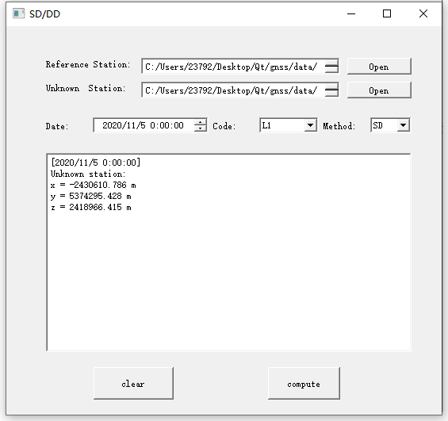

# GNSS

​	**A project for GNSS course**.

## Function

- [x] read **Broadcast Ephemeris**

- [x] read **Precise Ephemeris**

- [x] **SPP**(undifference) for different satellite navigation system(Except for GLO and GAL)

- [x] pseudo range **SD** and **DD** positioning

- [x] carrier phase **SD** and **DD** positioning

- [ ] multi-frequency positioning

  

​	

## Dependency

* Qt5

## Demo

